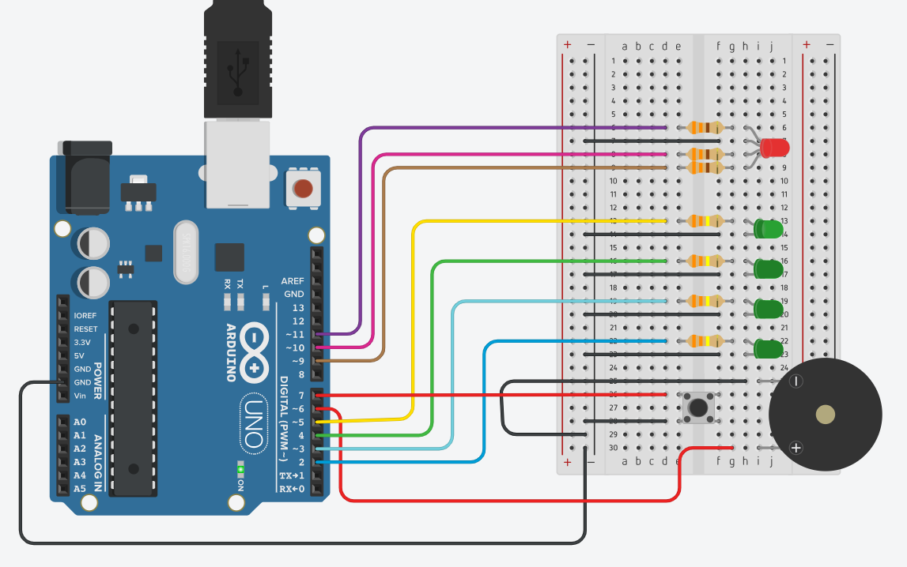

# IoT Pomodoro Timer
An Arduino-based Pomodoro timer with cloud data logging using ThingSpeak

## Overview

This project implements an IoT-based Pomodoro timer using an Arduino UNO R4 WiFi.
The system guides users through focused work and break sessions using visual and
audible feedback, while collecting productivity metrics that are uploaded to the
ThingSpeak cloud platform for analysis and visualisation.

## Features

- Finite State Machine (IDLE, WORK, BREAK)
- Non-blocking timing using `millis()`
- RGB LED state feedback
- Progress indicator LEDs
- Audible alerts using a buzzer
- WiFi connectivity and cloud data logging
- ThingSpeak dashboard visualisation

## Hardware Components

- Arduino UNO R4 WiFi
- RGB LED (common anode)
- Push button
- Piezo buzzer
- Progress LEDs
- Resistors
- Breadboard and jumper wires
- 
## System Architecture

The system is built around a finite state machine controlling the Pomodoro workflow.
The circuit was first designed and validated using Tinkercad before being implemented
on physical hardware.

## Cloud Integration

At the end of each Pomodoro cycle, session metrics such as total focus time,
resting time, and completed cycles are uploaded to ThingSpeak. The platform
provides time-series visualisation to support long-term productivity analysis.

## Repository Structure

- `/src` – Arduino source code
- `/images` – Diagrams and project images
- `README.md` – Project documentation
